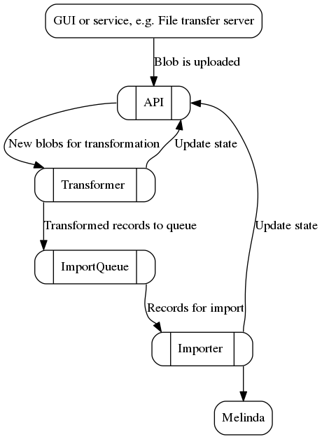

System for batch importing records to [Melinda](https://www.kansalliskirjasto.fi/en/services/metadata-reserve-services/melinda).

## Micro services

The system is implemented as micro services. Each service also depends on shared code implemented as a [Javascript module](https://github.com/NatLibFi/melinda-record-import-commons).

### API

[API](https://github.com/NatLibFi/melinda-record-import-api) provides methods for uploading blobs and altering their states.

### Transformer

[Transformer](https://github.com/NatLibFi/melinda-record-import-transformer) transforms blobs to records and published them in to the import queue.

### Importer

[Importer](https://github.com/NatLibFi/melinda-record-import-importer) fetches records from the import queue and imports them to Melinda.

## Import queue

AMQP queue for transformed records.

## Overview of the flow

